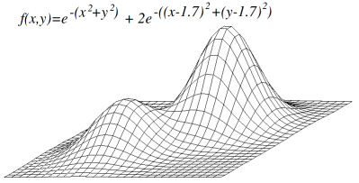

# Table of Contents
  * [Hill Climbing](#hill-climbing)
  * [Traveling Salesman Problem](#traveling-salesman-problem)
  * [# The algorithm](#the-algorithm)
    * [Compiling files](#Compiling-files) 
    * [Run algorithm](#Run-algorithm)


# Hill Climbing
Hill Climbing is a mathematical optimization technique used to solve search (optimization) problems. Having defined a search space, relative to the problem to be solved, the algorithm starts with a randomly chosen solution from that space and then tries to find a better solution by making an incremental change in the solution.

The goal of the algorithm is to find solutions that represent global maxima (or minima) in an ideal scenario, but eventually the algorithm can get stuck at local maxima.

> Hill-climbing techniques are well-suited for optimizing over such surfaces, and will converge to the global maximum. 
>
> -- *[Hill Climbling (Wikipedia)](https://en.wikipedia.org/wiki/Hill_climbing)*

The image below displays a search surface with two local maxima on it, so that only one of them is the global maximum.

<center>

|  | 
|:--:|
| [A surface with two local maxima](https://en.wikipedia.org/wiki/Hill_climbing#/media/File:Local_maximum.png) |

</center>

# Traveling Salesman Problem
> The travelling salesman problem (also called the travelling salesperson problem or TSP) asks the following question: "Given a list of cities and the distances between each pair of cities, what is the shortest possible route that visits each city exactly once and returns to the origin city?" 
>
> -- *[Travelling salesman (Wikipedia)](https://en.wikipedia.org/wiki/Travelling_salesman_problem)*


The definition of "shortest route" can be defined by the cost between going between cities. The way to represent cities, paths and costs is using a graph.

Traveling Salesman Problem can be interpreted as a graph problem. In other words it can be modelled an undirected weighted graph, so that cities are are vertices of graph, routes are edges, and a route distance is the weight of edge. 

In this specific case, it is a minimization problem which consists of starting the path at a vertex and going through all the others just once, having the lowest cost. In the other words here hill climbing algorithm is applied for minimization.

To programmatically represent the graph we use an ***adjacency matrix***. The matrix elements indicate whether the pairs of vertices are adjacent or not in the graph, thus representing their connections.

For example, the graph shown below is defined by the following adjacency matrix


<table align="center"">
  <tr>
    <th></th>
    <th scope="col">A</th>
    <th scope="col">B</th>
    <th scope="col">C</th>
    <th scope="col">D</th>
  </tr>
  <tr>
    <th scope="row">A</th>
    <td>0</td>
    <td>1</td>
    <td>1</td>
    <td>1</td>

  </tr>
  <tr>
    <th scope="row">B</th>
    <td>1</td>
    <td>0</td>
    <td>0</td>
    <td>0</td>

  </tr>
  <tr>
    <th scope="row">C</th>
    <td>1</td>
    <td>0</td>
    <td>0</td>
    <td>0</td>

  </tr>
  <tr>
    <th scope="row">D</th>
    <td>1</td>
    <td>0</td>
    <td>0</td>
    <td>0</td>

  </tr>
</table>

# The algorithm
The code implemented in this repository works as follows: it receives a graph, represented by an adjacent matrix, and generates a random sequence of vertices corresponding to a Traveling Salesman path. From this initial value (current value), generate all possible neighbors (neighborhood) using the 2-opt swap technique and thus compare the values ​​in order to find the route with the lowest cost, that is, we seek the best solution.

## How to run

### Compiling files 
* Clone repository
  ```bash
  git clone git@github.com:ViniciusMarchi/HillClimbing-algorithm.git
  ```

* Go to project file
  ```bash
  cd HillClimbing-algorithm
  ```

* Compile the files ```.java``` contained in ```hillclimbing``` direcotory using *javac* with the following command:
  ```bash
  javac -cp . hillclimbing/*.java -d ./out
  ```

This command will generate compiled ```.class``` files that will be stored in the ```/out/hillclimbing``` directory.

### Run algorithm
To run the algorithm, just execute the ```Main.class``` file, generated in the compilation process, but it is necessary to pass two arguments as parameters when executing this file.

1. ***Input file***: the path of a ```.txt``` file that contains the adjacency matrix of a graph. Note that the first line of the file must define the number of vertices of the graph.
2. ***Interations Number***: an integer that represents the number of iterations that the hillclimbing algorithm will perform. You are free to change this number as you wish.

As shown in the command below:
```bash
java  -cp ./out hillclimbing/Main graph01.txt 16

```

Some example input files are in this repository, they are ```graph01.txt```, ```graph02.txt``` e ```graph03.txt```.

In addition, also in this repository, a bash script file ```compile_and_run.sh``` is provided that executes the two commands above compiling and executing the code, in case you want to carry out the process in a more automated way. Of course, you can always add this code to an IDE if you don't want to compile manually.